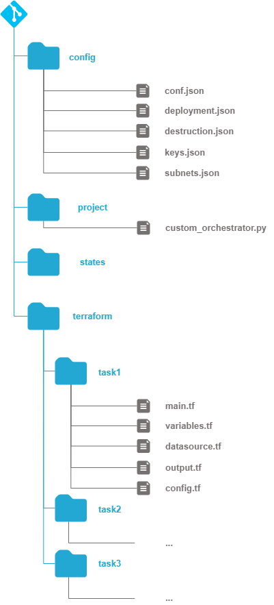

.. image:: docs/imgs/logo.png
   :alt: Logo

==========================
Technogix IaC orchestrator
==========================

About The Project
=================

This project provides a generic orchestrator to manage IaC jobs using python

.. image:: https://badgen.net/github/checks/technogix/it-orchestrator
   :target: https://github.com/technogix/it-orchestrator/actions/workflows/release.yml
   :alt: Status
.. image:: https://img.shields.io/static/v1?label=license&message=MIT&color=informational
   :target: ./LICENSE
   :alt: License
.. image:: https://badgen.net/github/commits/technogix/it-orchestrator/main
   :target: https://github.com/technogix/it-orchestrator
   :alt: Commits
.. image:: https://badgen.net/github/last-commit/technogix/it-orchestrator/main
   :target: https://github.com/technogix/it-orchestrator
   :alt: Last commit

Built With
----------

.. image:: https://img.shields.io/static/v1?label=robotframework&message=4.1.3&color=informational
   :target: http://robotframework.org/
   :alt: Robotframework
.. image:: https://img.shields.io/static/v1?label=boto3&message=1.21.7&color=informational
   :target: https://boto3.amazonaws.com/v1/documentation/api/latest/index.html
   :alt: Boto3
.. image:: https://img.shields.io/static/v1?label=pykeepass&message=4.0.1&color=informational
   :target: https://boto3.amazonaws.com/v1/documentation/api/latest/index.html
   :alt: Boto3

Why this orchestrator
=====================

When dealing with IaC projects, we often sumble on the same kind of issues :

* Sequencing a deployment often means intricating terraform and ansible infrastructure deployment with some small python tasks to do things terraform does not provide. Even if terraform can integrate ansible and python it is often more convenient to drive the sequencing through python that offers so much more flexibility

* Longer deployment should be splitted into smaller tasks that can be executed independantly to each other. even if terraform tasks does not do any infrastructure modification if no changes has been done to the deployment, even this analysis may become tedious when the number of infrastructure item grows.

* Managing parameters consistency between a large amount of tasks may become tedious, especially when  ecrets are involved. IaC tools all integrates with a vault, but each one gets its preferred one. Python does not use any natively. We want to rely on a shared vault with easy to use GUI interface. That's why this orchestrator relies on pykeepass and python to distribute secrets to all the jobs which needs it while ensuring they remain in-memory during all the process

* When the number of subnets grows in an infrastructure deployment, it is always a pain to find an available range for a new subnet with a given mask size. It is therefore convenient to get a simple script able to take into account all the subnets' masks needed and derive a set of compliant cidr ranges that do not overlap at each infrastructure deployment. It may become more complex when we do not want to change the cidr ranges that have already been allocated in your previous deployment to avoid unfortunate destruction and recreation of your existing infrastructure. One of the key task of this orchestrator is to automate this allocation.

Principle
=========

The tools provided here enable to build a sequence of IaC jobs relying on either terraform, ansible (to come) and/or python.

Each job is described as :

* A list of tasks to perform that can be in either terraform, python or ansible (yet to come)

* A list of variables to provide to each job, that can be either values , secrets or files

* A list of the network to create for the job, with their required cidr range and subregion.

The orchestrator then fulfils the following tasks :

Network ranges management
-------------------------

The orchestrator issues a set of cidr ranges for all infrastructure subnet with the following stpes :

* Checking existing infrastructure for already allocated cidr ranges

* Scan the required deployment subnets to detect masks changes or new subnets

* Derive the cidr ranges that will be allocated to the modified or new subnets without changing the existing ones.

Parameters management
---------------------

IaC job may rely on a large range of parameters, and though they could be stored associated to its task, it may become tedious and risky because :

* Secrets can NEVER be stored in a task configuration file.

* Ensuring consistency between each steps parameters means opening a large number of files...

* We would like to be able to manage complex variables such as json content and retrieve it from a separate file rather than polluting a configuration file with long parameters.

The IT orchestrator provides a centralized parameters management taking into account security issues

* Secrets shall be retrieved from the vaults and injected in IaC tools while ensuring that remain in-memory all along. IaC tools often integrate natively with a vault, but each one gets its own preferred vault and python does not use any natively. That's why this orchestrator relies on pykeepass and python to distribute secrets to all the jobs which needs it.

* Non secret values can be provided directly from a configuration file

* Files (json) may be provided through their filename and read as json into a given variable to be directly used in IaC tools.

It ensures the correct distribution of the variables to each steps when needed.

Other useful tools
------------------

It orchestrator also provides a set of useful tasks that are often used by deploiements, such as :

* Emptying s3 buckets prior to deletion

* Copying terraform states into an s3 buckets when it is not possible to use an s3 backend (for example, if your code shall build the terraform backend bucket prior to use it...)

* Setting up gitlab credentials from vault to enable retrieval of terraform modules during CI/CD

Prerequisites
=============

Python, terraform and ansible shall have been installed, in a docker container for example.

Toy deployment
==============

To better understand the way this orchestrator works, we will use a toy deployment all along this documentation. The
deployment we want to set consists in 2 separate steps :

* The first step perform 2 separate terraform tasks (meaning they won't share the same tfstate file). One of them is mandatory, meaning we want it to be performed at each deployment without having to bother with it

* The second step sequences a terraform task with a python task

To this aims, the following repository have been prepared :

In the *terraform* folder, we find 3 folders each associated to one of the 3 terraform tasks included in the deployment.
Each folder contains the classic terraform files, without the .tfvars file that will be generated by the orchestrator from The
shared deployment parameters set.

In the *states* folder, there is nothing yet. It will be used to store terraform states files when using local backend (states) before they
will be sent to a s3 backend

In the *project* folder, we put the customized orchestrator resulting from the overloading of the generic one provided here.
It mainly contains python custom tasks if needed.

In the *conf* folder, we put the deployment configuration files that will be described below to define the 2 steps deployment
sequencing we specified previously

To get a full real example on how we use this orchestrator, have a look at https://github.com/technogix/foundation

Configuring Deployment
----------------------

To configure a deployment, we've got to provide a json file describing what we may want to be able to do with it.

The *parameter* key enables the settings of parameters that will be shared between all jobs and tasks : the deployment topic,
to be used as cloud resources prefix, the default deployment region (that can be locally overloaded) and the contact information
to be associated to the resource

The *paths* key gives details on the deployment structure, providing the path to the *terraform* folder containing terraform tasks,
and a path to the *states* folder . Both folders are given relatively to the configuration file folder path.

The *workflow* key gives :

* The name of the file containing the deployment workflow containing the tasks needed to deploy the infrastructure

* The name of the file containing the destruction workflow containing the tasks needed to destroy the infrastructure (most of the time, they are not a simple reverse of each other - for example, when destroying s3 buckets, you need to empty them fist...)

* The name of the file containing the list of subnets that will be used in the infrastructure

* The name of the file containing all the parameters needed by the wworkflows.

.. code:: JSON
    {
        "parameters" : {
            "topic"			: "toy-deployment",
            "region" 		: "eu-west-1",
            "contact"		: "toy.deployment@gmail.com"
        },
        "paths"	: {
            "states" 	: "../states",
            "terraform" : "../terraform"
        },
        "workflows" : {
            "deployment"	: "deployment.json",
            "destruction"	: "destruction.json",
            "subnets"		: "subnets.json",
            "keys"			: "keys.json"
        }
    }

Workflows description
---------------------

Deployments are a list of steps including a set of tasks. You can choose to deploy or destroy every steps or any combination of
steps you think useful. We recommand that you use the same steps  in deployment and destruction workflow, and define your tasks
such as a state in the destruction workflow precisely destroy the resources created by the same step in the deployment workflow

Here is the deployment workflow for our toy deployment:

.. code:: JSON
    {
        "step1" : {
            "description" : "What step 1 should do"
            "tasks" : [
                { "description" : "Task 1 purpose", "mandatory" : false, "type" : "terraform", "path" : "step1", "state" : "step1" },
                { "description" : "Task 2 purpose", "mandatory" : true, "type" : "terraform", "path" : "step2", "state" : "step2" }
            ]
        },
        "step2" : {
            "description" : "What step 2 should do"
            "tasks" : [
                { "description" : "Task 3 purpose", "mandatory" : false, "type" : "terraform", "path" : "step3", "state" : "step3" },
                { "description" : "Task 4 purpose", "mandatory" : false, "type" : "python", "method" : "my_custom_step2_task4", "args" : { "custom_arg1" : "arg1", "custom_arg2" : "arg2"}}
            ]
        }
    }

Each task is described with the following features :

* A *description* feature stating the task purpose, to appear in the workflow console logs

* A *mandatory* feature. If the task is set as mandatory, it will be performed at each deployment, whether you selected its associated step or not.

* A *type* feature stating if the task is a terraform or a python task (ansible yet to come)

* A *path* feature (terraform task only) stating the path containing the terraform files for the task, relative to the terraform path set in the global configuration file

* A *state* feature (terraform task only) stating the prefix of the terraform tfstate file resulting from the task. The full filename will be derived as from the state path defined in the global configuration file with <global_state_path>/<state>.tfstate

* A *method* feature (python task only) stating the orchestrator method to be applied to perform the task. The method will be able to retrieve parameters from the global parameters list

* A *args* feature (python task only) enabling to provide additional constant parameters to the task method. May be useful to set something related to another task workflow parameters such as a state name to ensure consistency in the workflow

Parameters definition
---------------------

Parameters can either be retrieved from a vault (secrets), a configuration file value, or a file content. Each parameter is associated to
the job which uses it.

Here is an example for our toy deployment :

.. code:: JSON
    {
        "step1"       : {
            "var1"  : { "type" : "value", "value" : "oups! I did it again!"},
            "var2"  : { "type" : "value", "value" : [ 5, 6, 7, { "number" : "eight" } ]},
            "var3"  : { "type" : "file", "name" : "../my-beautiful_json_file.json" }
            "var4"  : { "type" : "secret",  "entry" : { "key" : "my_vault_key", "feature" : "password"} },
        },
        "step2"       : {
            "var5"  : { "type" : "secret",  "entry" : { "key" : "my_other_vault_key", "feature" : "username"} },
            "var6"  : { "type" : "value", "value" : { "key" : "value" },
        }
    }

Each parameter is described with the following features :

* A *type* feature stating if the variable is a value (value) , the content of the file (file), or a keepass vault secret

* A *value* feature (value parameter only) containing the value that should be assigned to the parameter

* A *name* feature (file parameter only) containing the json filename (relative to configuration directory) which content shall be read and assigned to the parameter

* An *entry* feature (secret parameter only) containing a json structure. The *key* value states the title of the keepass entry to retrieve parameter value. The *feature* value states if we want to retrieve username or password in the entry to assign it to the parameter.

Python tasks are relatively free to access any of those parameters in any way it whiches, but terraform tasks are more standardized.
They will be provided with a tfvars file containing :

* the global parameters set in the global configuration file

* the non secret parameters associated to the step they belong to.

* additional parameters directly set by the orchestrator : the type of environment we are deploying (prod, preprod, dev, staging,...), the git version associated to the deployment, and the module name from the deployment step name.

Secrets will be provided from the terraform command line.

For example, in our toy deployment, here are the conf.tfvars content and the command line that will be used to plan the
deployment :

Overloading orchestrator
------------------------

To define the custom orchestrator for our deployment, we use python overloading. We then just need to add the python method
that will be used for the second task of step 2

.. code:: python

    # orchestrator includes
    from orchestrator.orchestrator import Orchestrator

    class MyDeployment(Orchestrator) :

        m_my_specific_resource = None

        def __init__(self, version ) :
            """ Constructor
                version : version of the deployment to add as tag in cloud resources
            """
            super().__init__(version)
            self.m_my_specific_resource = ...

        def my_custom_step2_task4(self, step, custom_arg1, custom_arg2, ...) :
            # Loading deployment parameter that have already been loaded by orchestrator

            my_secret_value = self.m_configuration.get_parameter('step2')['var5']
            my_value        = self.m_configuration.get_parameter('step2')['var6']

            # Do something with parameters and additional custom args

Then we need to build the command line to launch orchestrator (here using click) :

.. code:: python

    @main.command()
    @option('--database', default='database.kdbx', help='Keepass database filename')
    @option('--key',default='database.keyx', help='Keepass database key file or master key environment variable name')
    @option('--username',default='prenom-nom', help ='Name of the user that will be responsible for AWS deployment - Its credentials shall be stored in vault as aws-<user>-access-key')
    @option('--version',default='unmanaged', help='Deployment repository current version to set as tag on infrastructure resources')
    @option('--configuration',default='conf.json', help='Global configuration file')
    @option('--environment',default='dev', help='Deployment stage (prod, preprod, staging, dev,... to set as tag on infrastructure resources')
    @option('--logging',default='../conf/logging.conf', help='Logging configuration file')
    @option('--step',multiple=True, help='Limited list of steps to apply (if none specified, all steps are applied')
    def deploy(database, key, username, version, configuration, environment, logging, step):

        is_status_ok = True

        if is_status_ok : deployment = Deployment(version)
        if is_status_ok : is_status = deployment.configure_logging(logging)
        if is_status_ok : log.info('-- INFRASTRUCTURE ' + environment.upper() + ' WILL BE DEPLOYED')

        if is_status_ok : log.info('-- 1   - Reading configuration file %s', configuration)
        if is_status_ok : is_status_ok = deployment.configure(configuration, environment)
        if is_status_ok : is_status_ok = deployment.workflow(database, key, step, username)

        if is_status_ok : log.info('-- Successfully deployed infrastructure')
        else            : log.info('-- Failed to deploy infrastructure - check logs for more info')

    @main.command()
    @option('--database', default='database.kdbx', help='Keepass database filename')
    @option('--key',default='database.keyx', help='Keepass database key file or master key environment variable name')
    @option('--username',default='prenom-nom', help ='Name of the user that will be responsible for AWS deployment - Its credentials shall be stored in vault as aws-<user>-access-key')
    @option('--version',default='unmanaged', help='Deployment repository current version to set as tag on infrastructure resources')
    @option('--configuration',default='conf.json', help='Global configuration file')
    @option('--environment',default='dev', help='Deployment stage (prod, preprod, staging, dev,... to set as tag on infrastructure resources')
    @option('--logging',default='../conf/logging.conf', help='Logging configuration file')
    @option('--step',multiple=True, help='Limited list of steps to apply (if none specified, all steps are applied')
    def destroy(database, key, username, version, environment, configuration, logging, step):
        """ Application run function """

        is_status_ok = True

        if is_status_ok : deployment = Deployment(version)
        if is_status_ok : is_status_ok = deployment.configure_logging(logging)
        if is_status_ok : log.info('-- INFRASTRUCTURE ' + environment.upper() + ' WILL BE DESTROYED')

        if is_status_ok : log.info('-- 1   - Reading configuration file %s', configuration)
        if is_status_ok : is_status_ok = deployment.configure(configuration, environment, True)
        if is_status_ok : is_status_ok =  deployment.workflow(database, key, step, username)

        if is_status_ok : log.info('-- Successfully destroyed infrastructure')
        else            : log.info('-- Failed to destroy infrastructure - check logs for more info')

    if __name__ == "__main__":
        main()

Executing deployment
--------------------

To execute the full deployment, use for example :

.. code:: bash

    python3 ./project/custom_orchestrator.py deploy \
    --database <keepass vault file>\
    --key <keepass vault key file> or <environment variable containing keepass vault master key value> \
    --username <devops_user> \
    --configuration ./conf/conf.json \
    --logging < logging configuration file path > \
    --version < gitlab deployment version >
    --environment < prod / preprod / staging / ... >

To destroy only the resources created at step 2, do :

.. code:: bash

    python3 ./project/custom_orchestrator.py destroy \
    --database <keepass vault file>\
    --key <keepass vault key file> or <environment variable containing keepass vault master key value> \
    --username <devops_user> \
    --configuration ./conf/conf.json \
    --logging < logging configuration file path > \
    --version < gitlab deployment version >
    --environment < prod / preprod / staging / ... >
    --step step2

Issues
======

.. image:: https://img.shields.io/github/issues/technogix/it-orchestrator.svg
   :target: https://github.com/technogix/it-orchestrator/issues
   :alt: Open issues
.. image:: https://img.shields.io/github/issues-closed/technogix/it-orchestrator.svg
   :target: https://github.com/technogix/it-orchestrator/issues
   :alt: Closed issues

Roadmap
=======

Contributing
============

.. image:: https://contrib.rocks/image?repo=technogix/it-orchestrator
   :alt: GitHub Contributors Image

We welcome contributions, do not hesitate to contact us if you want to contribute.

License
=======

This code is under MIT license

Contact
=======

Technogix - contact.technogix@gmail.com

Acknowledgments
===============

N.A.